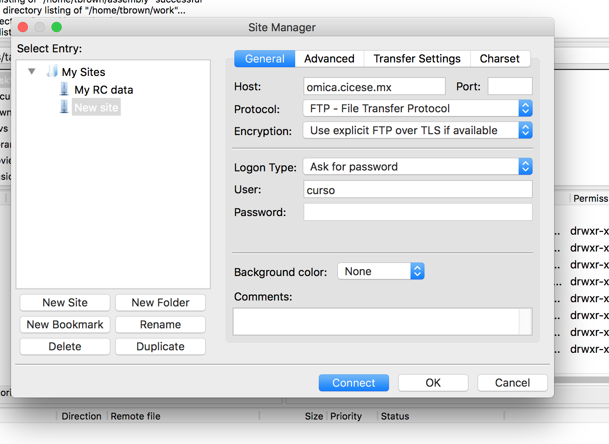
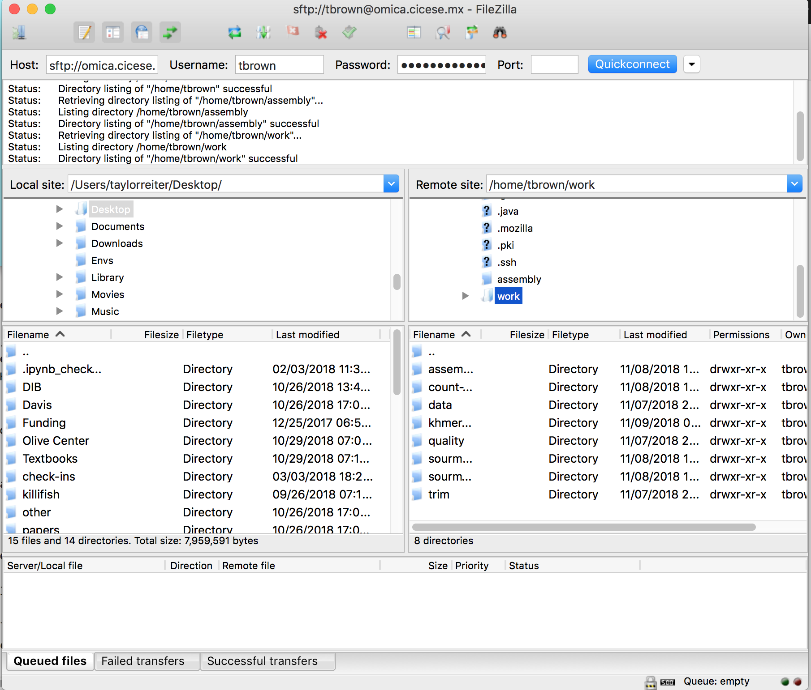

# Downloading and Transferring Files

Our goals for this lesson are:

* Transfer a file from a remote machine to your computer with FileZilla
* Transfer a file from your computer to a remote machine with FileZilla
* Name other tools that can be used for file transfer

## Transfer Files From Your Instance with Filezilla
We've made a lot of plots and QC files that would be nice for us to be able to view. and we have something unique that we would like to view. We will show you have to use FileZilla to transfer a file from your local machine to the cluster, or vice versa. 

### Open the site manager

Open *FileZilla*, and click on the File tab. Choose 'Site Manager'.
 

### Add your instances as a site

Within the 'Site Manager' window, do the following: 

1. Click on 'New Site', and name it something intuitive (e.g. omica)
2. Host: address of the omica cluster: 158.97.9.9 (or omica.cicese.mx)
3. Protocol: SFTP - SSH File Transfer Protocol
4. Logon Type: Ask for password
5. User: `curso`
6. Password: The password you use to log on to your instance. 
7. Click 'Connect'
	

You may see a dialogue pop up like this. Click ok!

Then, at the top of the screen, enter your host, username, and password, and click connect.

### Filezilla - Step 3

In FileZilla, on the left side of the screen navigate to the location you would like to save the file, and on the right side of the screen navigate through your remote directory until you find one of the plots we made earlier. Double click on the file to transfer a copy, or click and drag over to the right hand panel.

Open the file on your local machine, and bask in the glory of the plot you made!

We could also use `scp` or `rsync` to transfer files. These are command line utilities. If you're transferring a large datafile, `rsync` may be slightly better, because if the download fails it will restart from where it left off. The omica cluster doesn't allow us to use these tools by default, but many other clusters or cloud machines do, so it's good to keep them in mind. 
+ [rsync](https://rsync.samba.org/)
+ scp
